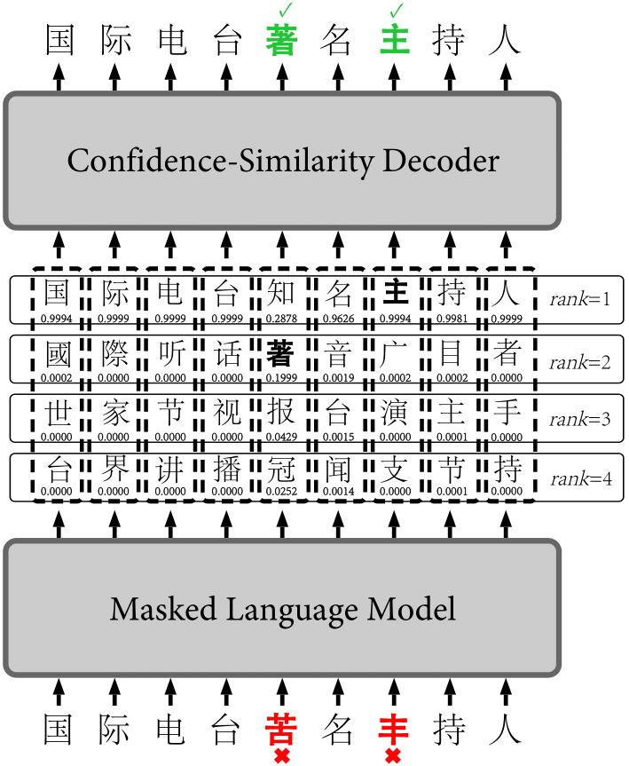

[中文版 README](https://github.com/iqiyi/FASPell/blob/master/README-CN.md)

# FASPell

This repository (licensed under GNU General Public License v3.0) 
contains all the data and code you need to build a state-of-the-art 
(by early 2019) Chinese spell checker and replicate the experiments 
in the original paper:

**FASPell: A Fast, Adaptable, Simple, Powerful Chinese Spell Checker
Based On DAE-Decoder Paradigm**  [LINK](https://www.aclweb.org/anthology/D19-5522.pdf)

, which is published in the Proceedings of the 2019 EMNLP 
Workshop W-NUT: The 5th Workshop on Noisy User-generated Text.

Upon use of our code and data, please cite our work as: 

    @inproceedings{hong2019faspell,
        title = "{FASP}ell: A Fast, Adaptable, Simple, Powerful {C}hinese Spell Checker Based On {DAE}-Decoder Paradigm",
        author = "Hong, Yuzhong  and
          Yu, Xianguo  and
          He, Neng  and
          Liu, Nan  and
          Liu, Junhui",
        booktitle = "Proceedings of the 5th Workshop on Noisy User-generated Text (W-NUT 2019)",
        month = nov,
        year = "2019",
        address = "Hong Kong, China",
        publisher = "Association for Computational Linguistics",
        url = "https://www.aclweb.org/anthology/D19-5522",
        pages = "160--169",
    }

## Overview
The task of Chinese spell checking (CSC) is conventionally reduced
to detecting and correcting substitution errors in Chinese texts. 
Other types of errors such as deletion/insertion errors are 
relatively rare.

FASPell is a Chinese spell checker which allows you to readily 
spell-check any kind of Chinese texts (simplified Chinese texts; 
traditional Chinese texts; human essays; OCR results, etc.) with 
state-of-the-art performance.

### Performance
The following figures describe the performance of FASPell on 
the SIGHAN15 test set.

sentence-level performance is:

|   | Precision | Recall  | 
| ------------- | ------------- | ------------- | 
| Detection  | 67.6% | 60.0% |
| Correction  | 66.6% | 59.1% |

character-level performance is:

|   | Precision | Recall  | 
| ------------- | ------------- | ------------- | 
| Detection  | 76.2% | 67.1% |
| Correction  | 73.5% | 64.8% |

This means that approximately 7 out of 10 error detections/corrections are correct 
and 6 out 10 errors can be successfully detected/corrected.
# Usage
This is a step-by-step instruction for you to build a Chinese spell
checker

## requirements

    python == 3.6
    tensorflow >= 1.7
    matplotlib
    tqdm
    java (required only if tree edit distance is used)
    apted.jar (required only if tree edit distance is used)
## data preparation
In this step, you download all the data [here](#Data). The data 
include the spell checking data (for both training and testing) 
and the character features used to compute character similarity.

Since most data used in FASPell is from other providers, note that 
downloaded data should be converted to our desired formats.

In the repo, we provide a few sample data as placeholders. 
Remember to overwrite them with the same file name once you have 
all the data.

After this step, if you are interested, you should be able to use 
the following script to compute character similarity:

    $ python char_sim.py 午 牛 年 千

Note that FASPell only adopts string edit distance to compute 
similarity. If you are interested in using tree edit distance 
to compute similarity, you need to download (from 
[here](https://github.com/DatabaseGroup/apted)) and compile a 
tree edit distance executable `apted.jar` into the home directory 
before running:

    $ python char_sim.py 午 牛 年 千 -t

## training and tuning
We highly recommend reading our paper before implementing this step.

There are three training processes (in order). Click the links to 
get their details:
1. pre-training a masked LM: [see here](#Pre-training)
2. fine-tuning the masked LM: [see here](#Fine-tuning)
3. tuning the filters in CSD: [see here](#CSD)

## runing the spell checker
Check if your working directory now looks like:

    FASPell/
      - bert_modified/
          - create_data.py
          - create_tf_record.py
          - modeling.py
          - tokenization.py
      - data/
          - char_meta.txt
      - model/
          - fine-tuned/
              - model.ckpt-10000.data-00000-of-00001
              - model.ckpt-10000.index
              - model.ckpt-10000.meta
          - pre-trained/
              - bert_config.json
              - bert_model.ckpt.data-00000-of-00001
              - bert_model.ckpt.index
              - bert_model.ckpt.meta
              - vocab.txt
      - plots/
          ...
      - char_sim.py
      - faspell.py
      - faspell_configs.json
      - masked_lm.py
      - plot.py
      

Now, you should be able to use the following command to spell-check
Chinese sentences:
    
    $ python faspell.py 扫吗关注么众号 受奇艺全网首播

You can also check sentences in a file (one sentence per line):

    $ python faspell.py -m f -f /path/to/your/file

To test the spell checker on a test set, set `"testing_set"` in 
`faspell_configs.json` to the path of the
test set and run:

    $ python faspell.py -m e

You can set `"round"` in `faspell_configs.json` to different values
and run the above commands to find the best number of rounds.

# Data
## Chinese spell checking data
1. human generated data:
    - SIGHAN-2013 shared task on CSC: 
    [LINK](http://ir.itc.ntnu.edu.tw/lre/sighan7csc_release1.0.zip)
    - SIGHAN-2014 shared task on CSC: 
    [LINK](http://ir.itc.ntnu.edu.tw/lre/clp14csc_release1.1.zip)
    - SIGHAN-2015 shared task on CSC: 
    [LINK](http://ir.itc.ntnu.edu.tw/lre/sighan8csc_release1.0.zip)
2. machine generated data:
    - OCR results used in our paper:
       - Tst_ocr: [LINK](https://github.com/iqiyi/FASPell/blob/master/data/ocr_test_1000.txt)
       - Trn_ocr: [LINK](https://github.com/iqiyi/FASPell/blob/master/data/ocr_train_3575.txt)
    
To use our code, the format of spell checking data should be like 
the following examples:

    #(errors)	erroneous sentence	correct sentence
    0	你好！我是張愛文。	你好！我是張愛文。
    1	下個星期，我跟我朋唷打算去法國玩兒。	下個星期，我跟我朋友打算去法國玩兒。
    0	我聽說，你找到新工作，我很高興。	我聽說，你找到新工作，我很高興。
    1	對不氣，最近我很忙，所以我不會去妳的。	對不起，最近我很忙，所以我不會去妳的。
    1	真麻煩你了。希望你們好好的跳無。	真麻煩你了。希望你們好好的跳舞。
    3	我以前想要高訴你，可是我忘了。我真戶禿。	我以前想要告訴你，可是我忘了。我真糊塗。

## Features of Chinese characters:
We use the features from two open databases. Please check their 
licenses before use.

|   | Database Name | Data Link  | File used in our paper |
| ------------- | ------------- | ------------- | ------------- |
| Visual features※  | [漢字データベースプロジェクト(Kanji Database Project)](http://kanji-database.sourceforge.net/) | [LINK](https://github.com/cjkvi/cjkvi-ids) | ids.txt |
| Phonological features  | [Unihan Database](https://unicode.org/charts/unihan.html) | [LINK](https://unicode.org/Public/UNIDATA/Unihan.zip) | Unihan_Readings.txt |

※ Note that the original **ids.txt** per se does not provide 
stroke-level IDS (for compression purpose). However, it should 
be easy to use tree recursion (starting from the IDS of simple 
characters which do have stroke-level IDS) to produce stroke-level 
IDS for all characters yourself. 

The feature file (`char_meta.txt`) that can be used with our code should have the 
following format:

    unicode	character	pronunciations of CJKV lanugages	stroke-level IDS
    U+4EBA	人	ren2;jan4;IN;JIN,NIN;nhân	⿰丿㇏
    U+571F	土	du4,tu3,cha3,tu2;tou2;TWU,THO;DO,TO;thổ	⿱⿻一丨一
    U+7531	由	you2,yao1;jau4;YU;YUU,YUI,YU;do	⿻⿰丨𠃌⿱⿻一丨一
    U+9A6C	马	ma3;maa5;null;null;null	⿹⿱𠃍㇉一
    U+99AC	馬	ma3;maa5;MA;MA,BA,ME;mã	⿹⿱⿻⿱一⿱一一丨㇉灬

where:
* the CJKV pronuncation string follows the format of: 
`MC;CC;K;JO;V`;
* when a character in a language is polyphonic, possible sounds are 
seperated with `,`;
* when a character does not have a pronunciation in a language, use 
`null` as a placeholder.

# Masked LM
## Pre-training
To replicate the experiments in our paper or to get a pre-trained 
model instantly, you can download the 
[pre-trained model](https://storage.googleapis.com/bert_models/2018_11_03/chinese_L-12_H-768_A-12.zip) used in the paper. 

To pre-train one youself, follow the instructions of the 
[GitHub repo for BERT](https://github.com/google-research/bert).

Put everything related to the pretrained model under 
`model/pre-trained/` directory

## Fine-tuning
To produce the fine-tuning examples as described in the paper, 
run the following commands

    $ cd bert_modified
    $ python create_data.py -f /path/to/training/data/file
    $ python create_tf_record.py --input_file correct.txt --wrong_input_file wrong.txt --output_file tf_examples.tfrecord --vocab_file ../model/pre-trained/vocab.txt

Then, all you need to do is to continue training the pretrained 
model following the same commands for pretraining described in 
[GitHub repo for BERT](https://github.com/google-research/bert) 
except using the pretrained model as the initial checkpoint.

Put the checkpoint files of the fine-tuned model under 
`model/fine-tuned/`. Then, set the `"fine-tuned"` in the `faspell_configs.json` to
the path of the the fine-tuned model.

# CSD
The tuning of the filters in CSD may cost you quite some time because 
it is relatively complicated.

## overall settings for tuning CSD
As described in the paper, we need to manually find a filtering 
curve for each group of candidates. In this code, we include a 
small hack where each group is divided into two sub groups. And 
we need to find a filtering curve for each sub group as well. 
The division criterion is whether the first-rank candidate is 
different from the original character (i.e., 
`top_difference=True/False`). This hack helps because we observe 
that the value of `top_difference` has a big impact on the 
distribution of candidates on the confidence-similarity scatter 
graphs, as you will observe along the tuning process.

We recommend the order of sub groups to find a filtering 
curve for to be:

    top_difference=True, sim_type='shape', rank=0
    top_difference=True, sim_type='shape', rank=1
    top_difference=True, sim_type='shape', rank=2
            ...        ,       ...       ,   ...
    top_difference=True, sim_type='sound', rank=0
    top_difference=True, sim_type='sound', rank=1
    top_difference=True, sim_type='sound', rank=2
            ...        ,       ...       ,   ...
    top_difference=False, sim_type='shape', rank=0
    top_difference=False, sim_type='shape', rank=1
    top_difference=False, sim_type='shape', rank=2
            ...        ,       ...       ,   ...
    top_difference=False, sim_type='sound', rank=0
    top_difference=False, sim_type='sound', rank=1
    top_difference=False, sim_type='sound', rank=2

To have sim_type='shape', you need to set `"visual": 1` and 
`"phonological": 0` in `faspell_configs.json`; to have 
sim_type='sound', you need to set `"visual": 0` and 
`"phonological": 1` (keep `"union_of_sims": false`, 
which allows the curves for visual similarity and the ones for 
phonological similarity to be independently tuned.). To have rank=n, 
set `"rank": n`. 

Before start tuning, note that to use the maked LM to produce the 
candidates each time may cost you quite some time. Therefore, we 
recommend saving the candidates in the tuning process for the first 
group and then reusing them for later groups. Setting the 
`dump_candidates` to a saving path will help you save the 
candidates; for later groups, set `read_from_dump` to `true`.

## workflow for tuning the filter for each group of candidates
For each `top_difference=True` sub group of candidates, run:

    $ python faspell.py -m e -t -d

or for each `top_difference=False` sub group of candidates, run:

    $ python faspell.py -m e -t

then, you will see the corresponding `.png` plots under directory 
`plots/`. Note that there will be enlarged `.png` plots for 
candiates distributed towards the high-confidence and low-similarity 
corner(right-bottom corner), where candidates are very densely 
distributed, to help you find the best curve.

For each sub group, you use the plots to find the curve, then put it 
into the `Curves` class as a function (returns False if a candidate 
is below the curve) and call the function in `__init__()` of the 
`Filter` class.

## post-tuning settings
When tuning is done, remember to change `"union_of_sims"` to 
`true` (which will forced the union of the results using the 
two different types of similarity regardless of the value of 
`"visual"` and `"phonological"`). Set `"rank"` to be the 
highest rank you tune the filter with. Also, change 
`dump_candidates` to `''` (empty string) and `read_from_dump` 
to `false`.

